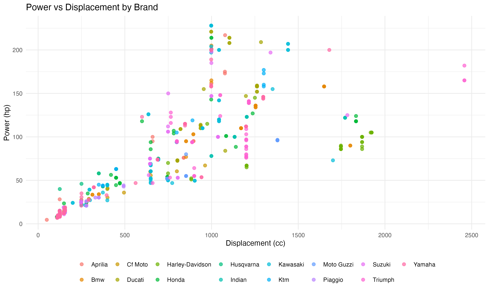
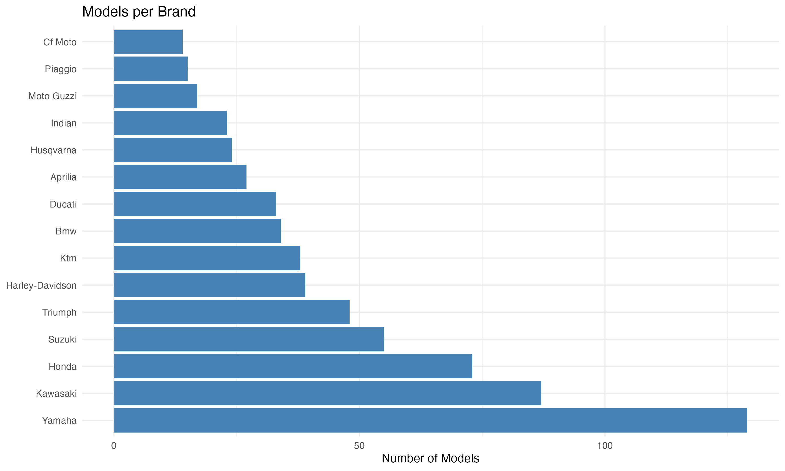
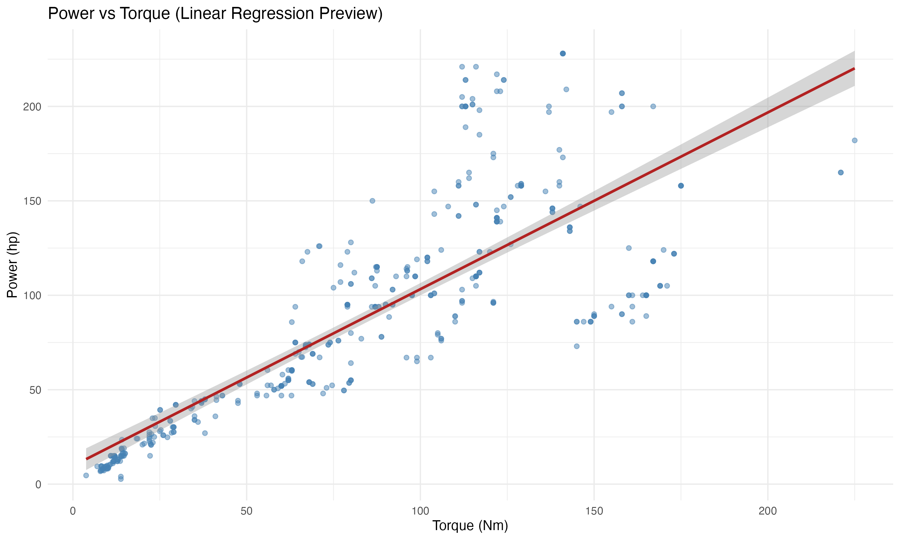
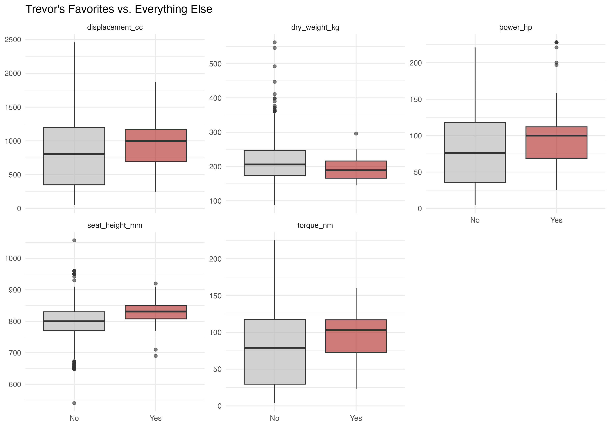

# 🏍️ Motorcycle Specs 2020 — A Curated Dataset for Regression Analysis

A (semi) cleaned dataset of **656 motorcycle models from 15 major manufacturers**, all from model year 2020. Built for teaching **linear and logistic regression** in an applied statistics course.

---

## Overview

| Feature | Value |
|---|---|
| **Rows** | 656 motorcycles |
| **Columns** | 23 variables |
| **Model Year** | 2020 (all observations) |
| **Brands** | 15 major global manufacturers |
| **File** | `moto_2020.csv` |

The dataset spans a wide range of motorcycle types — from 49cc scooters to 2,458cc touring machines — across sport bikes, adventure bikes, cruisers, naked bikes, enduro, motocross, and more. It includes a custom binary variable, `trevors_fav`, designed as a logistic regression target.

---

## Source & Citation

This dataset was derived from a large-scale web scraping project hosted on Kaggle:

> **Motorcycle Specifications Dataset (1894–2022)**
> Source: [Kaggle]([https://www.kaggle.com/](https://www.kaggle.com/datasets/emmanuelfwerr/motorcycle-technical-specifications-19702022))
> Original dataset: ~25,000+ motorcycles across all years and manufacturers worldwide.

The original data was filtered to model year 2020, subset to 15 major brands, cleaned, and restructured for classroom use. If you use this dataset in your own work, please cite both the original Kaggle source and this repository.

---

## How This Dataset Was Built

The raw scrape contained **1,631 motorcycles from 172 brands** for the 2020 model year alone. Many of those brands were regional, niche, or boutique manufacturers with sparse and inconsistent data. The cleaning process focused on retaining high-quality, analytically useful observations:

### Step 1 — Brand Selection
We analyzed each brand's **model count** and **data completeness** (the proportion of non-missing values across six key numeric variables: displacement, power, torque, dry weight, seat height, and fuel capacity). This revealed major global OEMs clustered in the upper-right of the size-vs-quality space, while the long tail of 150+ small brands contributed noise and missingness.

Fifteen brands were manually selected based primarily on brands I know alongside model count and data quality:

| Brand | Models | Avg Completeness |
|---|---|---|
| Yamaha | 129 | 0.69 |
| Kawasaki | 87 | 0.77 |
| Honda | 73 | 0.69 |
| Suzuki | 55 | 0.72 |
| Triumph | 48 | 1.00 |
| Harley-Davidson | 39 | 0.96 |
| KTM | 38 | 0.81 |
| BMW | 34 | 0.83 |
| Ducati | 33 | 0.97 |
| Aprilia | 27 | 0.75 |
| Husqvarna | 24 | 0.77 |
| Indian | 23 | 0.91 |
| Moto Guzzi | 17 | 0.86 |
| Piaggio | 15 | 0.81 |
| CF Moto | 14 | 0.82 |

### Step 2 — Column Cleaning
- Renamed columns for usability.
- **Dropped 6 free-text columns** that contained long, unstructured strings: front/rear suspension descriptions, front/rear brake descriptions, fuel system text, and color option lists.
- Retained 22 core variables (+ 1 added later).

### Step 3 — Type Enforcement
- Numeric columns cast to `numeric` (Year as `integer`).
- Low-cardinality categoricals cast to `factor`: Brand (15 levels), Category (16), engine_cyl (10), engine_stroke (3), Gearbox (7), fuel_control (6), cooling (3), trans_type (3).
- High-cardinality identifiers kept as `character`: Model, front_tire, rear_tire.

### Step 4 — Custom Feature Engineering
Added a binary variable, `trevors_fav`, to flag 59 motorcycles as personal favorites. This would be good practice in logistic regression becasue my taste in bikes vary, even though I lean toward ADV and dual sports, there are beautiful supermotos and high-displacement machines across multiple brands.

---

## Variable Dictionary

### Identifiers & Classification

| Variable | Type | Description | Missing |
|---|---|---|---|
| `Brand` | Factor (15) | Manufacturer name | 0% |
| `Model` | Character | Model name (656 unique) | 0% |
| `Year` | Integer | Model year (all 2020) | 0% |
| `Category` | Factor (16) | Motorcycle type (Sport, Naked Bike, Touring, etc.) | 0% |

### Engine Specifications

| Variable | Type | Description | Missing |
|---|---|---|---|
| `displacement_cc` | Numeric | Engine displacement in cubic centimeters (49–2,458) | 1.2% |
| `power_hp` | Numeric | Peak horsepower (1.6–228) | 27.9% |
| `torque_nm` | Numeric | Peak torque in Newton-meters (3.8–225) | 26.8% |
| `bore_mm` | Numeric | Cylinder bore diameter in mm (36–116) | 4.3% |
| `stroke_mm` | Numeric | Piston stroke length in mm (39.2–118) | 4.3% |
| `engine_cyl` | Factor (10) | Cylinder configuration (Single Cylinder, V2, Twin, In-Line Four, etc.) | 0% |
| `engine_stroke` | Factor (3) | Combustion cycle (Four-Stroke, Two-Stroke, Electric) | 0% |
| `fuel_control` | Factor (6) | Valve train type (DOHC, SOHC, Desmodromic, OHV, Pushrods, etc.) | 17.1% |
| `cooling` | Factor (3) | Cooling system (Liquid, Air, Oil & Air) | 2.9% |

### Drivetrain

| Variable | Type | Description | Missing |
|---|---|---|---|
| `Gearbox` | Factor (7) | Number of gears (2-Speed through 7-Speed, Automatic) | 7.6% |
| `trans_type` | Factor (3) | Final drive type (Chain, Belt, Shaft Drive) | 5.2% |

### Dimensions & Capacity

| Variable | Type | Description | Missing |
|---|---|---|---|
| `dry_weight_kg` | Numeric | Dry weight in kilograms (41.5–562) | 59.6% |
| `wheelbase_mm` | Numeric | Wheelbase in millimeters (830–1,808) | 6.1% |
| `seat_height_mm` | Numeric | Seat height in millimeters (475–1,057) | 5.3% |
| `fuel_cap_lts` | Numeric | Fuel tank capacity in liters (1.89–30) | 3.5% |

### Tires

| Variable | Type | Description | Missing |
|---|---|---|---|
| `front_tire` | Character | Front tire size designation (123 unique) | 8.2% |
| `rear_tire` | Character | Rear tire size designation (165 unique) | 8.1% |

### Other

| Variable | Type | Description | Missing |
|---|---|---|---|
| `Rating` | Numeric | User rating on source website (2.6–4.1) | 64.5% |
| `trevors_fav` | Factor (2) | My favorite bikes: Yes (59) / No (597) | 0% |

---

## Key Dataset Characteristics

### Brand Distribution

Yamaha contributes the most models (129), followed by Kawasaki (87) and Honda (73). The Japanese Big Four account for over half the dataset.

### Category Breakdown

The 16 motorcycle categories span the full spectrum of two-wheeled (and four-wheeled, via ATVs) vehicles:

| Category | Count | | Category | Count |
|---|---|---|---|---|
| Sport | 96 | | Touring | 36 |
| Enduro / Offroad | 90 | | Super Motard | 34 |
| Scooter | 70 | | Cross / Motocross | 33 |
| Naked Bike | 69 | | Classic | 29 |
| Custom / Cruiser | 63 | | Sport Touring | 17 |
| Allround | 61 | | Other (4 categories) | 20 |
| ATV | 38 | | | |

### Engine Configurations

Single-cylinder engines dominate (273 models, 42%), followed by V-twins (150) and parallel twins (85). The dataset also includes inline-fours, inline-threes, V4s, boxers (super cool), inline-sixes (also fun), and electric motors.

### Missingness

Most variables are well-populated. Two stand out as problematic:
- **Rating** (64.5% missing) — not recommended as a primary analysis variable.
- **Dry weight** (59.6% missing) — usable for subset analyses but will reduce sample size substantially.

All other variables are under 28% missing, and 13 of 23 variables are under 10% missing.

### Correlation Highlights

Among key numeric variables (pairwise complete):
- **Displacement ↔ Torque**: r = 0.97 (think about why)
- **Displacement ↔ Dry Weight**: r = 0.83
- **Power ↔ Torque**: r = 0.81
- **Dry Weight ↔ Seat Height**: r = −0.69 
- **Power ↔ Stroke**: r = 0.06 (interesting to discuss)

### Trevor's Favorites

59 of 656 bikes (9%). These tend to skew toward higher displacement, higher power, and adventure/dual-sport categories.

---

## Suggested Use Cases

### Linear Regression
- **Power from displacement, engine configuration, and brand** — good mix of continuous and categorical predictors with natural interactions.
- **Torque from bore, stroke, and displacement** — explores multicollinearity (bore × stroke ≈ displacement).
- **Weight from displacement, category, and fuel capacity** — substantial missingness .

### Logistic Regression
- **Predicting `trevors_fav`** from specs — "Can you predict my taste in motorcycles?" Imbalanced classes (9% Yes) invite discussion of class imbalance, thresholds, and evaluation metrics beyond accuracy.
- **Category-based binary outcomes** (e.g., Sport vs. Non-Sport/ Brand country of origin) can also be engineered.

### Exploratory / Descriptive
- Brand comparisons, category profiling, engine configuration analysis, and missing data pattern exploration.

---

## License & Usage

This dataset is provided for **educational purposes**. The original data was sourced from a publicly available Kaggle dataset. Please cite appropriately if used in coursework, publications, or derivative projects.
